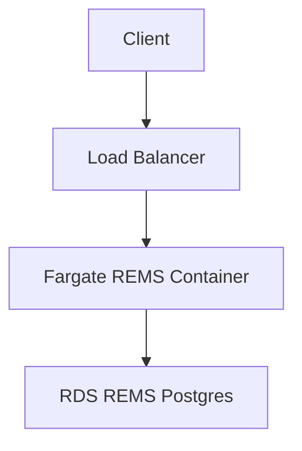

# REMS

A CDK stack for deploying REMS into an AWS
environment.

The CDK stack sets up a standalone VPC with REMS Docker images
running in Fargate in a private subnet. Public access is then provided
via an SSL application load balancer.

The CDK stack can be deployed, destroyed etc using a thin wrapper around
the CDK binary - `rems-cdk.sh`.

A lambda is also created for easy execution of REMS control commands
such as "migrate" etc - and this lambda can be launched from the
accompanying `rems-cmd.sh`.

## Getting Started

There is some AWS/Auth infrastructure that need to be setup prior to
installing REMS. Whilst this may look like a lot - it is actually relatively
easy for anyone with AWS experience to set this up (possibly this would be
doable in an hour).

1. An AWS account
2. A CloudMap namespace
3. A domain name (and corresponding zone) installed into Route 53
4. An SSL certificate installed matching the above domain name
5. A SES setup allowing sending emails
6. An OpenId identity provider for users

All the above infrastructure is slow to set up and tear down - and is
often shared across multiple software stacks - so we do not attempt to
construct them as part of the CDK. Instead we record their values in
a couple of configuration spots.

For this installation walk through - we will pretend that we are doing
an installation for BioCommons that we want to end up hosted as

```
https://rems.demo.biocommons.dev
```

We will also imagine that we are going to use an Okta installation
that will contain our list of users.

### CloudMap Namespace

Create a CloudMap namespace (API mode) and enter the namespace name
into the file

`rems-cloudmap-namespace.txt`

This namespace is the glue that binds various separate services together
and allows them to locate each other.

### A Domain Name in Route 53

### An SSL Certificate

### An SES

## AWS Architecture



A new standalone VPC is created for this deployment (this could
be changed if desired).

The load balancer is created in the public subnet, and all other
activity (lambdas, fargate, rds) occurs in the private subnet.

## Useful commands

### CDK

`rems-cdk` is a lightweight wrapper around `cdk` that also sets
REMS configuration settings using parameter store etc. Other than
passing in these settings, its usage is identical to regular `cdk`.

- `./rems-cdk deploy` deploy this stack to your default AWS account/region
- `./rems-cdk diff` compare deployed stack with current state

### REMS

For details of the CMDs that work with REMS - see

https://github.com/CSCfi/rems/blob/master/src/clj/rems/standalone.clj

(the 'help' output)

Some examples are

- `./rems-cmd "migrate"`
- `./rems-cmd "list-users"`
- `./rems-cmd "grant-role owner abcdefg;list-users"`
