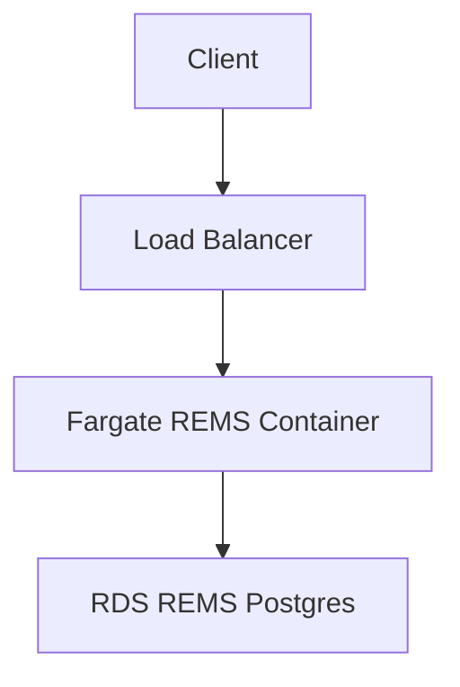

# REMS

A [CDK](https://docs.aws.amazon.com/cdk/v2/guide/home.html) stack
for deploying [REMS](https://github.com/CSCfi/rems) into an AWS
environment.

REMS (Resource Entitlement Management System) is a tool for
managing access rights to resources, such as research datasets.

CDK (Cloud Development Kit) is a language/tool for deploying
infrastructure and software into AWS in a safe/repeatable manner.

## Getting Started

There is some AWS/Auth infrastructure that need to be setup prior to
installing REMS. Whilst this may look like a lot - it is actually relatively
easy for anyone with AWS experience to set this up (possibly this would be
doable in an hour).

1. An AWS account
2. A CloudMap namespace
3. A domain name (and corresponding zone) installed into Route 53
4. An SSL certificate installed matching the above domain name
5. A SES setup allowing sending emails
6. An OpenId identity provider for users

All the above infrastructure is often shared across multiple
software stacks in an AWS account - so we do not attempt to
construct them as part of the CDK. 

A detailed walk through including screenshots is shown below.

[Detailed AWS Setup instructions](docs/AWS-SETUP.md)


## Configuring the deployment

At the end of the process of "Getting Started", we will either have created
new infrastructure in our AWS account - or chosen existing infrastructure
to re-use.

We now need to record the values of this infrastructure into a configuration
file so that the REMS CDK scripts can do the deployment.

The first file we need to edit is `rems-cloudmap-namespace.txt`. This holds
the CloudMap namespace details - and is used by our scripts to share AWS
settings.

After that, the only other file to edit is `rems-cdk.sh`. There are instructions
within that shell script file you should read.

In our example - most of the setting are set by filling in an environment
variable.

```bash
HOSTED_ZONE_NAME="biocommons.dev"
```

**Some** of our parameters are considered 'secret' and therefore are not appropriate
for checking into a GitHub repository. For these parameters, we have filled in
values using AWS Parameter Store

```
  ...
   --context "oidcClientSecret=$(aws ssm get-parameter --name 'oauth_client_secret' --output text --query 'Parameter.Value')" \
  ...
```

You can modify the `rems-cdk.sh` script to use any technique appropriate for your
environment. As long as the settings are passed into the CDK invocation as 'context' - you should
be good to go.

## Deploying

The CDK stack can now be used by invoking a thin wrapper around
the CDK binary - `rems-cdk.sh`.

Open a shell with the correct AWS credentials for your account (or modify each of the
following commands to use `--profile yourprofile`)

```bash
rems-cdk.sh deploy
```


A lambda is also created for easy execution of REMS control commands
such as "migrate" etc - and this lambda can be launched from the
accompanying `rems-cmd.sh`.


## AWS Architecture

The CDK stack sets up a standalone VPC with REMS Docker images
running in Fargate in a private subnet. Public HTTP is then provided
via an SSL enabled application load balancer.



A new standalone VPC is created for this deployment (this could
be changed if desired).

The load balancer is created in the public subnet, and all other
activity (lambdas, fargate, rds) occurs in the private subnet.

## Useful commands

### CDK

`rems-cdk` is a lightweight wrapper around `cdk` that also sets
REMS configuration settings using parameter store etc. Other than
passing in these settings, its usage is identical to regular `cdk`.

- `./rems-cdk deploy` deploy this stack to your default AWS account/region
- `./rems-cdk diff` compare deployed stack with current state

### REMS

For details of the CMDs that work with REMS - see

https://github.com/CSCfi/rems/blob/master/src/clj/rems/standalone.clj

(the 'help' output)

Some examples are

- `./rems-cmd "migrate"`
- `./rems-cmd "list-users"`
- `./rems-cmd "grant-role owner abcdefg;list-users"`
