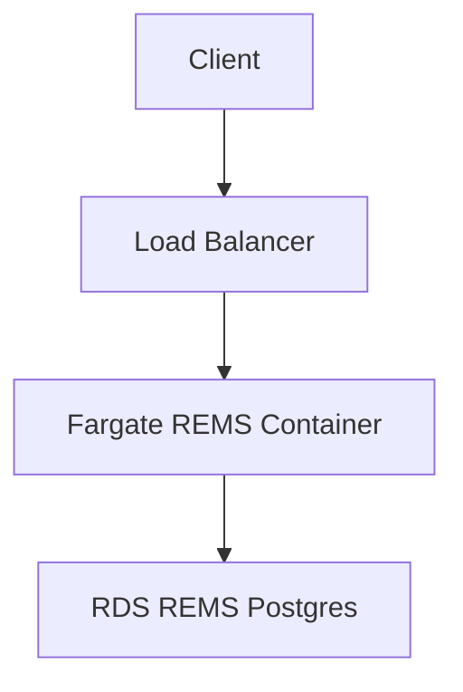

# REMS

A [CDK](https://docs.aws.amazon.com/cdk/v2/guide/home.html) stack
for deploying [REMS](https://github.com/CSCfi/rems) into an AWS
environment. This deployment is suitable for a production grade
deployment (it is securely isolated in AWS and uses managed Postgres
and load balancing). It can be "in-place" upgraded and configured.

REMS (Resource Entitlement Management System) is a tool for
managing access rights to resources, such as research datasets.

CDK (Cloud Development Kit) is a language/tool for deploying
infrastructure and software into AWS in a safe/repeatable manner.

## Getting Started

There is some AWS/Auth infrastructure that need to be setup prior to
installing REMS. Whilst this may look like a lot - it is actually relatively
easy for anyone with AWS experience to set this up (possibly this would be
doable in an hour).

1. An AWS account
2. A CloudMap namespace
3. A domain name (and corresponding zone) installed into Route 53
4. An SSL certificate installed matching the above domain name
5. A SES setup allowing sending emails
6. An OpenId identity provider for users

All the above infrastructure is often shared across multiple
software stacks in an AWS account - so we do not attempt to
construct them as part of the CDK. 

A detailed walk through including screenshots is shown below.

[Detailed AWS Setup instructions](docs/AWS-SETUP.md)

## Deployment

At the end of the process of "Getting Started", we will either have created
new infrastructure in our AWS account - or chosen existing infrastructure
to re-use.

A detailed walk through of where the configuration settings need to be
changed and how the actual deployment is done is shown below.

[Detailed AWS Deploy instructions](docs/AWS-DEPLOY.md)

## Maintaining

The nature of CDK means that updates to the software stack are handled intelligently.
If you change any settings (say changing the amount of memory for the Fargate instance)
you can just do the `./rems-cdk.sh deploy` again and AWS will work out the steps
necessary to deploy the new software - whilst keeping the existing service
running.

Other maintenance that needs to be done in REMS (such as migrating to new database
versions or changing user permissions) should be done
with `rems-cmd.sh`. For details of the CMDs that work with REMS (see
https://github.com/CSCfi/rems/blob/master/src/clj/rems/standalone.clj - the 'help' output)

### A new REMS version

When a new REMS version is published at the REMS github release page
(https://github.com/CSCfi/rems/releases) - you can
upgrade your instance

1. Check the release notes for any breaking changes

2. Edit `iac/rems-docker-image/Dockerfile` and change the line

    `ADD https://github.com/CSCfi/rems/releases/download/v2.27/rems.jar /rems/rems.jar`

   to match the new version
 
3. Execute `./rems-cdk.sh deploy` again
 
4. Execute `./rems-cmd.sh "migrate"` to pick up any new database migrations (if needed)

### A REMS config change

1. Edit `iac/rems-docker-image/config.edn` and make any changes you want
2. Execute `./rems-cdk.sh deploy` again

## AWS Architecture

The CDK stack sets up a standalone VPC with REMS Docker images
running in Fargate in a private subnet. Public HTTP is then provided
via an SSL enabled application load balancer.

A new standalone VPC is created for this deployment (this could
be changed if desired).

The load balancer is created in the public subnet, and all other
activity (lambdas, fargate, rds) occurs in the private subnet.

## Useful commands

### CDK

`rems-cdk` is a lightweight wrapper around `cdk` that also sets
REMS configuration settings using parameter store etc. Other than
passing in these settings, its usage is identical to regular `cdk`.

- `./rems-cdk deploy` deploy this stack to your default AWS account/region
- `./rems-cdk diff` compare deployed stack with current state
- `./rems-cdk destroy` uninstall the entire stack from AWS
