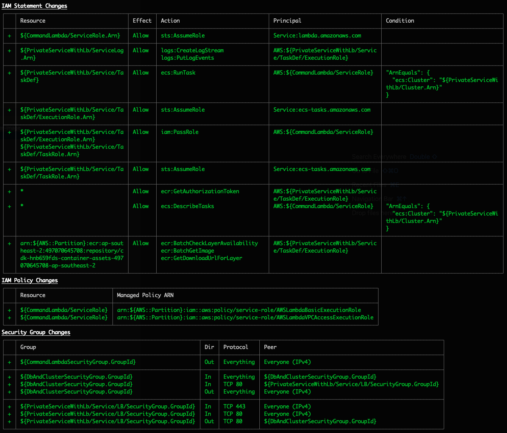
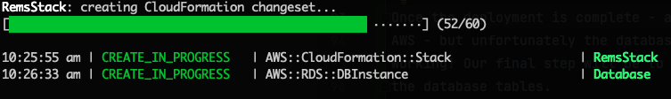
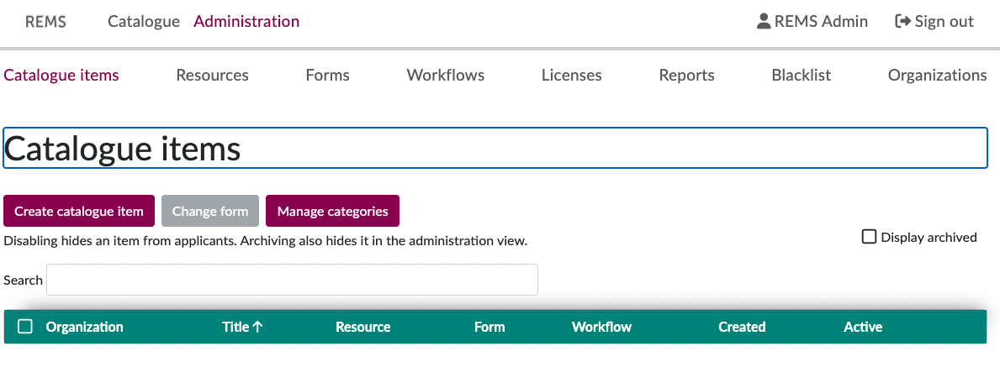

# AWS DEPLOY

## Configuring

We need to record the values of any infrastructure into a configuration
file so that the REMS CDK scripts can do the deployment.

The first file we need to edit is `rems-cloudmap-namespace.txt`. This holds
the CloudMap namespace details - and is used by our scripts to share AWS
settings.

After that, the only other file to edit is `rems-cdk.sh`. There are instructions
within that shell script file you should read.

In our example - most of the setting are set by filling in an environment
variable.

```bash
HOSTED_ZONE_NAME="biocommons.dev"
```

**Some** of our parameters are considered 'secret' and therefore are not appropriate
for checking into a GitHub repository. For these parameters, we have filled in
values using AWS Parameter Store

```
...
 --context "oidcClientSecret=$(aws ssm get-parameter --name 'oauth_client_secret' --output text --query 'Parameter.Value')" \
...
```

You can modify the `rems-cdk.sh` script to use any technique appropriate for your
environment. As long as the settings are passed into the CDK invocation as 'context' - you should
be good to go.

## Deploying

The CDK stack can now be used by invoking a thin wrapper around
the CDK binary - `rems-cdk.sh`.

Docker should be running and the AWS account you are using will need
to be bootstrapped (this is true of any use of CDK so we will not go into details here -
see `https://docs.aws.amazon.com/cdk/v2/guide/bootstrapping.html`).

Open a shell with the correct AWS credentials for your account (or modify each of the
following commands to use `--profile yourprofile`)

```bash
./rems-cdk.sh deploy
```

You will be given a list of all the permissions changes expected by this deployment -
which will be extensive given this is the first deployment. You should inspect the
changes to see they make sense (they should be similar to those shown below)
and assuming they do - you can hit 'Y' to continue.



The deployment will now progress in AWS. This could take 15-20 minutes!



Eventually once done, all the resources will now be present in
AWS - but unfortunately the database will be blank and hence REMS will not yet be
working!

Our final step will be to issue the commands to tell REMS to migrate
the database tables.

We have deployed a special piece of AWS code that allows us to safely
issue REMS control commands such as "migrate" etc. This code can be launched
using `rems-cmd.sh`.

We start the database migration with

```bash
./rems-cmd.sh "migrate"
```

Note that we include the quotes because if we want to do multiple REMS command
they all need to appear between a single set of quotes and separated with a semicolon.

After this migration completes, we should be able to visit `https://rems.biocommons.dev`
and Login. Login as the user who you want to be overall administrator - for the moment
they will not see much data.

We then need to get a list of the users in REMS.

```bash
./rems-cmd.sh "list-users"
```

The output will then show some lines like

```text
2022... rems/rems/... 2022-07-12 02:00:07,709 [main - - -] INFO  com.zaxxer.hikari.HikariDataSource - HikariPool-1 - Start completed.
2022... rems/rems/... {"userid":"auth0|62412e5cfec0a2006fa9cfaa","name":"REMS Admin","email":"...","roles":["logged-in"]}
2022... rems/rems/... ####################
```

The "userid" is the subject identifier asserted from the OIDC provider - and is what REMS uses
to refer to users.

We need to make this administrator user the "owner" of the REMS instance so that they can perform
administrative tasks. Once this is done - that administrator can designate other owners within
the REMS UI (so this step should only really have to be done once).

```bash
./rems-cmd.sh "grant-role owner auth0|62412e5cfec0a2006fa9cfaa"
```

Now we can log in and see the REMS UI as a full administrator.


