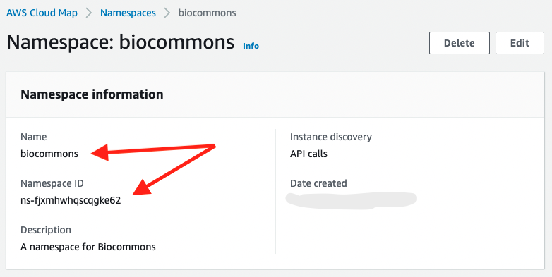

# AWS SETUP

For this AWS setup walk through - we will pretend that we are doing
an installation for BioCommons that we intend to host at

```
https://rems.biocommons.dev
```

We will also imagine that we are going to use an Okta installation
that will contain our list of users.

## CloudMap Namespace

Create a CloudMap namespace (API mode). The namespace is a place in AWS
where we can share common runtime settings. It binds various separate
services together - allowing them to locate each other.


Once created, we need to view the namespace to get access to some
settings.



Enter the namespace name and id as two lines into the file `rems-cloudmap-namespace.txt`

For example

```
biocommons
ns-fjxmhwhqscqgke62
```


## A Domain Name in Route 53

Create a Route 53 zone (public) for the base domain name - in
our case `biocommons.dev`. This will be where DNS entries for our
services will be created and how SSL certificates will be configured.


There will need to be some (non-AWS) way in which you
have registered your base domain and point it to this new Route 53 zone -
unfortunately that is very dependent on your choice of registrar.

For Google Domains I registered the domain and set the custom nameservers
to point to AWS.


Again, this will be totally dependent on how your DNS registrar works.


## An SSL Certificate

Request an SSL certificate to be managed by AWS. This certificate will
help secure all traffic to the server (the browser padlock). AWS managed certificates
are free as long as they are attached to an AWS service. They will automatically
renew, so you do not need to worry about them after initial creation.

We chose to make a wildcard certificate (`*.biocommons.dev`) as this single
certificate could then be used for other deployments. It would be also possible
to just register the single DNS name you want for your deployment (`rems.biocommons.dev`).


Once created, we need to view the certificate to get some settings.


You may also need to hit the "Create Records in Route 53" button which will
create entries to help validate your ownership of the domain.

## Simple Email Service

Created a Verified identity in the Simple Email Service. This service will be
used by REMS to send out notification emails.

We create an identity


that allows us to send emails from the domain.

We also need to use authenticated SMTP to send emails - so we need to create a
SMTP user in AWS and remember its username/password for configuration.

The "create SMTP credentials" is a button at the bottom of the dashboard in SES.


and the created user ends with a dialog like


## OpenId Provider (not AWS)

An OpenId provider is used by REMS to provide identities for the login
system. There are many OpenId compatible identity providers and we cannot
go through configuring them all. 

All of them have in common the concept that the "Application" will need
to be registered (providing a Callback URL - in our case based on our
domain name we will provide `https://rems.biocommons.dev/oidc-callback`). The
result of the registration will provide two settings - a client id and
client secret that will need to be registered in our REMS configuration.

As an example, we will show the
configuration used for Auth0 for our example
installation.


